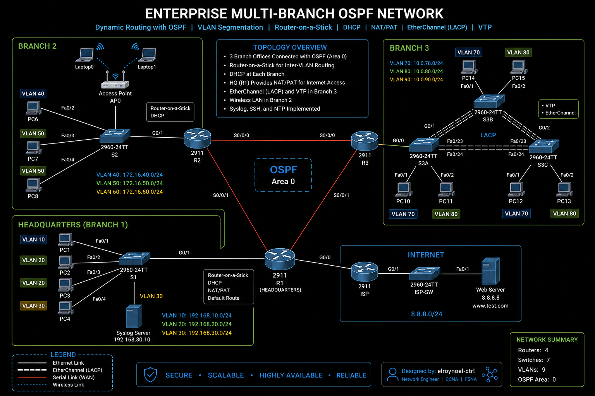

# 02 – Enterprise Multi-Branch OSPF Network


---

## Project Overview

This repository documents the design, implementation, verification, and troubleshooting of a multi-branch enterprise network built in **Cisco Packet Tracer**. The project connects three branch offices using **Open Shortest Path First (OSPF)** dynamic routing while integrating essential enterprise networking services including VLAN segmentation, Router-on-a-Stick, DHCP, NAT/PAT, EtherChannel (LACP), WLAN connectivity, SSH, NTP, and Syslog.

Rather than simply completing a Packet Tracer exercise, this repository presents the lab as a professional enterprise deployment with comprehensive documentation, configuration files, verification procedures, and troubleshooting methodologies commonly used by network engineers.

---

# ⭐ Project Highlights

- 🏢 Three interconnected enterprise branch offices
- 🌐 Dynamic routing using OSPF
- 🔀 Router-on-a-Stick Inter-VLAN routing
- 🖧 VLAN implementation with VTP
- 🔗 EtherChannel (LACP) for redundancy and increased bandwidth
- 📡 Enterprise WLAN integration
- 🌍 Internet connectivity using NAT/PAT
- 🔒 Secure remote device management with SSH
- 🕒 Time synchronization using NTP
- 📝 Centralized logging with Syslog
- ✅ Comprehensive verification and troubleshooting documentation

---

# Project Objectives

- Design a scalable multi-branch enterprise network.
- Implement dynamic routing using OSPF.
- Configure Router-on-a-Stick for Inter-VLAN routing.
- Deploy VLANs using VTP.
- Configure DHCP for automatic IP address assignment.
- Provide Internet connectivity using NAT/PAT.
- Configure EtherChannel (LACP) between switches.
- Integrate enterprise wireless networking.
- Secure network devices using SSH.
- Synchronize network devices using NTP.
- Configure centralized Syslog logging.
- Verify end-to-end network connectivity.
- Produce enterprise-quality technical documentation.

---

# Enterprise Network Features

## Routing

- OSPF Dynamic Routing
- Multi-Branch Connectivity
- Automatic Route Advertisement
- Fast Convergence

## Switching

- VLAN Segmentation
- Router-on-a-Stick
- VTP
- EtherChannel (LACP)
- Trunk Links
- Access Ports

## Network Services

- DHCP
- NAT/PAT
- Internet Connectivity

## Wireless

- Enterprise WLAN
- Wireless Client Connectivity

## Network Management

- SSH
- NTP
- Syslog

---

# Technologies Used

| Category | Technology |
|----------|------------|
| Routing | OSPF |
| Switching | VLANs, VTP, Trunking |
| Redundancy | EtherChannel (LACP) |
| Services | DHCP, NAT/PAT |
| Wireless | WLAN |
| Management | SSH, NTP, Syslog |
| Platform | Cisco Packet Tracer |

---

# Network Specifications

| Item | Implementation |
|------|----------------|
| Routing Protocol | OSPF |
| Branch Offices | 3 |
| VLANs | Multiple |
| Inter-VLAN Routing | Router-on-a-Stick |
| DHCP | Enabled |
| Internet Access | NAT/PAT |
| VTP | Enabled |
| EtherChannel | LACP |
| Wireless | Integrated WLAN |
| Secure Management | SSH |
| Time Synchronization | NTP |
| Logging | Syslog |

---

# Repository Structure

```text
02-Enterprise-Multi-Branch-OSPF-Network
│
├── README.md
├── docs
│   ├── Network-Design.md
│   ├── Configuration-Guide.md
│   ├── Verification.md
│   ├── Troubleshooting.md
│   └── Lessons-Learned.md
│
├── configs
│
├── topology
│
├── verification
│
└── packet-tracer
```

---

# Enterprise Topology



---

# Documentation

| Document | Description |
|----------|-------------|
| **Network-Design.md** | Enterprise architecture and design decisions |
| **Configuration-Guide.md** | Complete implementation guide |
| **Verification.md** | Command verification and validation |
| **Troubleshooting.md** | Issues encountered and resolutions |
| **Lessons-Learned.md** | Technical insights and project reflection |

---

# Skills Demonstrated

- Enterprise Network Design
- OSPF Dynamic Routing
- Router-on-a-Stick
- VLAN Planning
- VTP Configuration
- EtherChannel (LACP)
- DHCP Deployment
- NAT/PAT Configuration
- Enterprise Wireless Networking
- SSH Administration
- NTP Configuration
- Syslog Configuration
- Network Verification
- Network Troubleshooting
- Technical Documentation

---

# Verification Highlights

The completed implementation validates:

- ✅ OSPF neighbor adjacencies established
- ✅ Dynamic route exchange between branches
- ✅ Successful Inter-VLAN routing
- ✅ DHCP address assignment
- ✅ Internet connectivity through NAT/PAT
- ✅ EtherChannel operational
- ✅ VTP synchronization
- ✅ Wireless client connectivity
- ✅ SSH remote administration
- ✅ NTP synchronization
- ✅ Syslog event logging
- ✅ End-to-end connectivity across the enterprise

---

# Portfolio Progress

| Status | Project |
|--------|---------|
| ✅ | 01 – Enterprise Campus Network Foundation |
| 🚧 | **02 – Enterprise Multi-Branch OSPF Network** |
| ⏳ | 03 – Enterprise EIGRP Multi-Area Network |
| ⏳ | 04 – Enterprise BGP Route Reflector |
| ⏳ | 05 – Enterprise BGP Confederation |
| ⏳ | 06 – Enterprise Dual-ISP BGP Network |
| ⏳ | 07 – Enterprise DMVPN |
| ⏳ | 08 – Enterprise MPLS/VPN Concepts |
| ⏳ | 09 – Enterprise SD-WAN Fundamentals |
| ⏳ | 10 – Hybrid Cloud Networking |

---

# Lessons Learned

This project demonstrates how enterprise routing, switching, network services, wireless connectivity, and management technologies integrate to create a scalable and resilient network. It reinforces not only implementation skills but also the importance of structured design, validation, troubleshooting, and professional documentation.

---

# About This Portfolio

This repository is part of my hands-on enterprise networking portfolio documenting progressively more advanced Cisco networking projects. Each project emphasizes real-world design principles, structured implementation, comprehensive verification, and professional documentation.

---

# Author

**Elroy Noel**

**CCNA Certified**

Building an enterprise networking portfolio through hands-on Cisco enterprise networking projects.

**GitHub:** https://github.com/elroynoel-ctrl

---

⭐ *Thank you for visiting this repository. Feel free to explore my other enterprise networking projects as I continue expanding my portfolio.*
